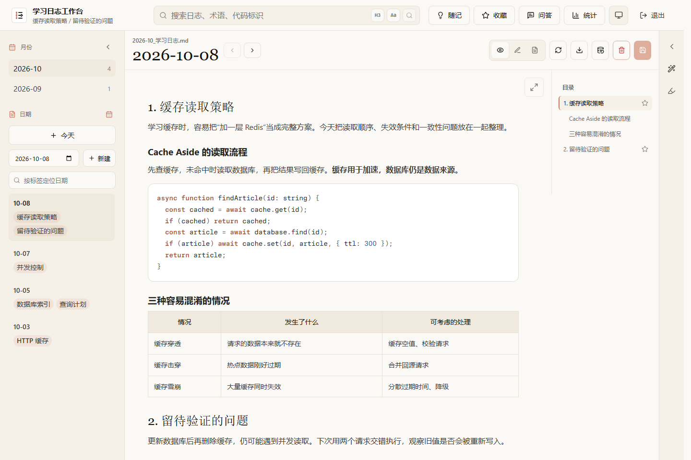
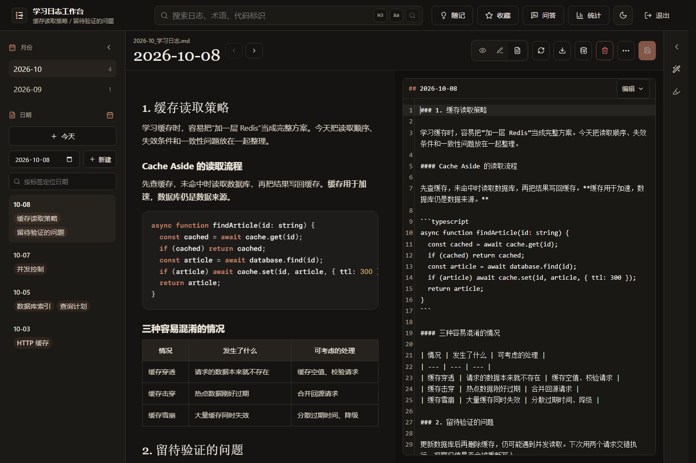

# 学习日志工作台

读文档、看课程、写代码、排查问题，一天过得很充实。可隔了一周再回头，往往只记得自己很忙：那个概念是怎么理解的？当时的问题又是怎么解决的？收藏的文章还在，自己的学习过程却未必留下了记录。

**学习日志工作台，让每天学过的内容有迹可循。** 它面向愿意使用 Markdown 的技术学习者，把笔记按学习日期组织起来：今天读懂的概念、试过的代码、还没解决的疑问，都可以记在当天。几句话也能成为一篇记录，不必等到整理成完整文章才开始。

日期串起学习过程，小节留下具体主题。以后可以沿着日期回看、搜索术语和代码，或从收藏的小节接着学；配置 AI 后，还能围绕已有日志提问，顺着回答中的来源回到当时的记录。从“今天学了什么”到“后来还找得到”，这些操作都围绕同一份学习记录展开。

学习记录可以保存在自己的电脑，也可以放在自己部署的服务器上。未配置 AI，也能记录、整理和查找。

## 能做什么

- **每日记录**：按月份和日期组织 Markdown，支持代码、公式、表格、Mermaid 和图片；提供常用格式操作、日志历史版本与单日恢复。
- **整理知识**：用随记保存零散想法，用收藏标记值得回顾的小节；导出已保存的内容与附件。
- **找回经历**：搜索日志、术语和代码；统计记录日期、数量与主题分布，不评价知识掌握程度。
- **按需使用 AI**：从材料生成待审阅草稿、重点标注和随记候选；三套技术学习写作预设可复制为个人方案。结果不会自动保存为日志。
- **带来源的问答**：配置聊天模型和检索服务后，从已有日志中查找答案。引用仍需核对，不保证模型理解正确。

## 界面预览

网页与 Windows 桌面端共用以下编辑界面，截图使用合成学习记录。

**阅读 · 浅色模式**：从左侧日期和主题找到记录，通过右侧目录浏览当天内容。



**分屏编辑 · 深色模式**：Markdown 源码与预览并排展示，边写边查看排版。



## 选择使用方式

**希望不部署服务器、在本机离线记录，请使用 Windows 桌面端。** 本地模式下，记录、查找和备份无需联网；AI 功能需要访问所配置的模型服务，使用远程模型时需要联网。网页和鸿蒙客户端需要连接服务器，不提供客户端独立离线模式；服务器可部署在局域网，不一定需要公网。

| 方式 | 适合谁 | 从哪里开始 |
| --- | --- | --- |
| Windows 桌面端本地使用 | 希望离线记录，不部署服务器 | [桌面端使用说明](docs/windows-desktop.md) |
| 自部署服务器 | 希望浏览器、Windows 和鸿蒙访问同一份学习记录 | [预构建镜像 + Docker Compose 部署指南](deploy/README.md) |
| 鸿蒙客户端 | 已有可连接的服务器 | [鸿蒙构建、签名与连接说明](study-log-harmony/README.md) |

Windows 桌面端既可本地使用，也可连接服务器。本地学习记录与服务器学习记录**各自保存，不会自动同步**；多个客户端连接同一服务器时才共用同一份学习记录。Windows 本地服务默认只供这台电脑访问。

这是单使用者工作台，不提供多用户账号、公共云服务或自动跨设备同步。源码按 MIT 许可开放；当前仍为试用阶段。

当前预发布版本为 rc.6，Windows 安装包和配套服务器镜像已发布。变更与实际验证范围见[发布记录](docs/release-rc6-2026-10-08.md)。

### Windows：安装后开始记录

1. 安装桌面试用包，首次打开选择“本地使用”，确认保存位置。
2. 点击“今天”，写下学习内容并保存；关闭应用会正常停止本地服务。
3. 需要 AI 时再到“文件 → 模型设置…”配置。需要独立备份时使用“文件 → 创建完整备份…”。

无需安装 Node、Docker 或另开浏览器。下载 [Windows x64 安装包](https://github.com/Torry2022/study-log-workbench-public/releases/download/v0.1.0-rc.8/study-log-desktop-0.1.0-rc.8-x64-setup.exe)，或查看[预发布说明与 SHA-256 校验文件](https://github.com/Torry2022/study-log-workbench-public/releases/tag/v0.1.0-rc.8)。安装包尚未签名；也可按[桌面构建说明](docs/windows-desktop.md#开发与验收)自行构建。此前的[浏览器本地包](docs/windows-portable.md)仍保留，但不是首选入口。

### 服务器：使用预构建镜像

准备自己的 Linux amd64 主机及 Docker Compose，下载[服务器部署配置包](https://github.com/Torry2022/study-log-workbench-public/releases/download/v0.1.0-rc.8/study-log-server-0.1.0-rc.8.zip)（或使用 `deploy/` 中的文件），按[部署指南](deploy/README.md)完成初始化和启动。使用公开 ACR 镜像无需阿里云账号，也无需在服务器安装 Node 或构建源码。

镜像、Compose 示例和[版本说明](deploy/RELEASE-NOTES.md)配套使用；不要混用版本。首次先验证本机访问，再按需配置模型、HTTPS 和其他客户端。域名及服务器由部署者自行准备，本项目不提供公共服务地址，也不修改其他应用的配置。

## 保存与备份

日志、随记和附件保存在指定文件夹中；配置也保存在这里，保留月／年 Markdown 文件组织方式。项目不会自动从源码父目录查找日志。

- **日志历史版本**用于恢复误改的某一天，默认保留；Windows 可设置开关和保留期限。它与原记录保存在同一文件夹，不能代替独立备份。
- **完整备份**由用户主动创建，包含学习记录、附件及配置，应另存到其他磁盘或设备；恢复写入新目录，不覆盖原有学习记录。
- **导出**用于取出已保存内容，不等同于完整备份。归档包含密钥且未加密，请私密保存。

详见[备份与恢复](docs/backup-restore.md)。本地与服务器间搬迁不建立自动同步。

## 配置与开发

AI 接口、个人写作方案及只读检索配置见[AI 配置](docs/ai-configuration.md)和[部署说明](docs/deployment.md)。不配置向量或重排服务时，可使用关键词检索。

从源码运行需要 Node.js 22.13 或更新版本。以下为 Windows PowerShell 示例，在仓库根目录执行：

```powershell
npm --prefix study-log-web ci
node ops/instance.mjs init "D:\workbench-instance"
npm run build
node ops/run-web.mjs start "D:\workbench-instance" 3560
```

示例保存位置应尚不存在，或使用已有学习记录的有效目录。初始化不会在终端打印密码；在保存位置的 `.env` 中查看 `APP_PASSWORD`，访问 `http://127.0.0.1:3560/study-log`。不要提交学习记录、环境文件、归档或签名材料。其他系统及 Docker 源码构建见[开发部署说明](docs/deployment.md)。

源码按 `study-log-web/`、`study-log-mcp/`、`study-log-harmony/` 和 `ops/` 组织。参考[架构](docs/architecture.md)、[接口契约](docs/api-contract.md)、[配套发布流程](docs/releasing.md)和[设计规范](DESIGN.md)；许可证见 [LICENSE](LICENSE)，依赖声明见 [THIRD_PARTY_NOTICES.md](THIRD_PARTY_NOTICES.md)。

## 当前边界

- Windows 安装、同版本覆盖安装、保留学习记录及归档恢复已有维护者测试；安装包未签名，跨版本数据迁移未完成验证。
- 服务器镜像当前支持 Linux amd64。部署版本及验证范围以[版本说明](deploy/RELEASE-NOTES.md)为准。
- 鸿蒙支持手机、平板和 PC，当前以源码构建和侧载为主。使用者需自行配置签名；维护者调试包不适用于所有设备。独立签名及异网络 HTTPS 连接仍待验。
- Wiki、分享、跨设备接续和鸿蒙独立离线存储暂未提供。

这些结果来自维护者及自动化验收，不代表外部用户反馈。当前结果及剩余条件见[进度总览](docs/current-status.md)。详细记录保留在[实施状态](docs/implementation-status.md)、[桌面端说明](docs/windows-desktop.md)、[服务器验收](docs/server-deployment-acceptance.md)和[鸿蒙迁移记录](docs/harmony-migration.md)，不必先读这些记录才能开始使用。
